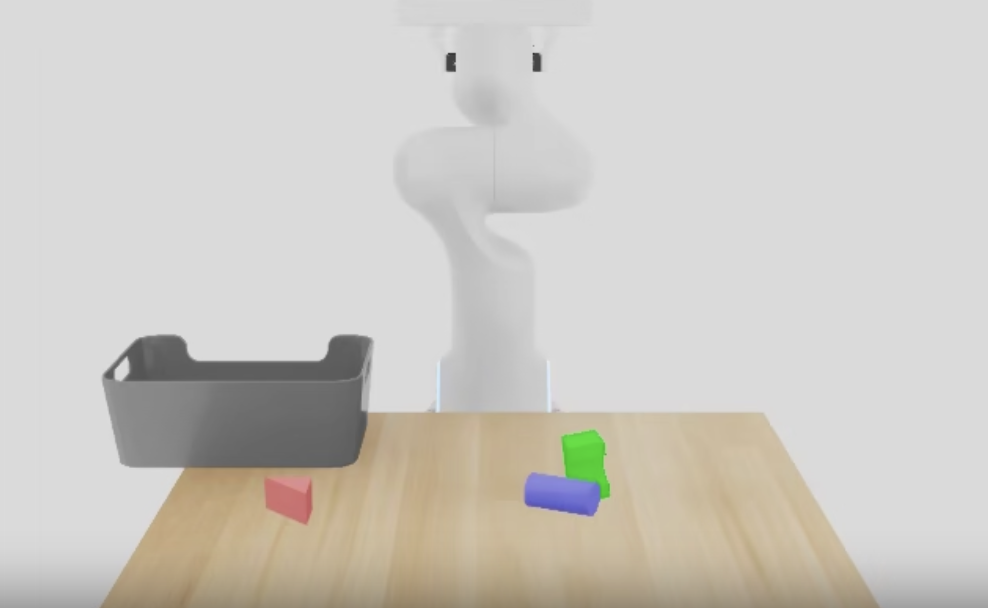

# AI Capstone Spring 2026 — Project Report

**Task:** Toy Block Collection (Living Room Scenario)

---

## 1. Task Description

### 1.1 Task Overview

We work on the **Toy Block Collection** task in a living room scenario. Three toy blocks are randomly scattered on a tabletop, and the robot must pick them all up and place them into a designated basket.

*Figure 1. Simulation scene — three randomly placed toy blocks (red, green, blue) and the target basket.*

The challenge lies in handling variable initial positions: the blocks may appear anywhere on the table, so the policy must generalize across different spatial configurations rather than memorizing a fixed sequence.

### 1.2 Objectives and Success Criteria

The task is considered successful when all three blocks are inside the basket at the end of a rollout. We evaluate performance by success rate over 30 rollout trials under randomized block placements.

### 1.3 (Advanced) Motivation for the Proposed New Task

---

## 2. Data Collection

### 2.1 Real-World Data Collection with UMI

#### 2.1.1 Data Collection Procedure

#### 2.1.2 Conversion to Training Dataset

#### 2.1.3 Data Visualizations

### 2.2 Simulation Data Collection in Isaac Sim

#### 2.2.1 Dataset Composition and Size

#### 2.2.2 Data Collection Methods Breakdown

#### 2.2.3 Data Visualizations

#### 2.2.4 (Advanced) Changes and Design Compared to Entry Level

---

## 3. Policy Training

### 3.1 Model Architecture

#### 3.1.1 Baseline Architecture

#### 3.1.2 (Advanced) Architecture Modifications and Motivations

### 3.2 Training Procedure

#### 3.2.1 Hyperparameters

#### 3.2.2 Training Configuration

---

## 4. Experimental Results

### 4.1 Data Quality Analysis

### 4.2 Quantitative and Qualitative Results of Policy Models

#### 4.2.1 Training Loss Curves

#### 4.2.2 Rollout Success Rate

#### 4.2.3 Rollout Screenshots

### 4.3 (Advanced) Evaluation Procedure

#### 4.3.1 Evaluation Criteria and Environment Configurations

#### 4.3.2 Rationale Behind Evaluation Design

### 4.4 (Advanced) Results

---

## 5. Discussion

### 5.1 Insights and Observations

### 5.2 Challenges Encountered

### 5.3 Future Directions

---

## 6. Work Distribution

---

## References
